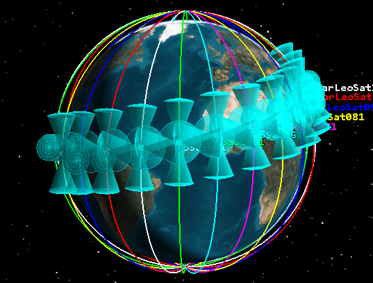
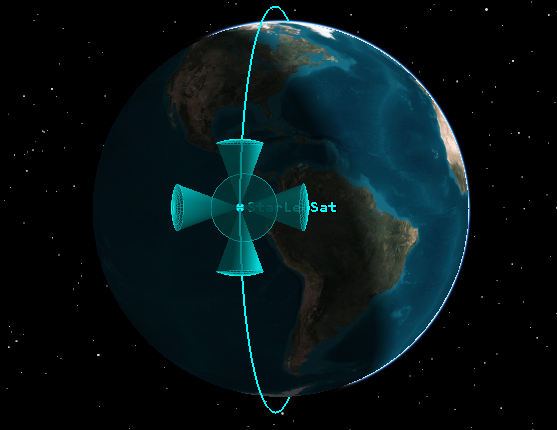
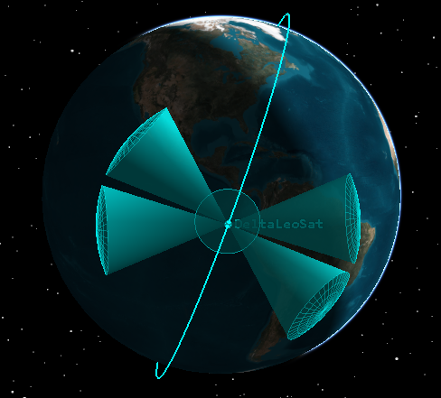
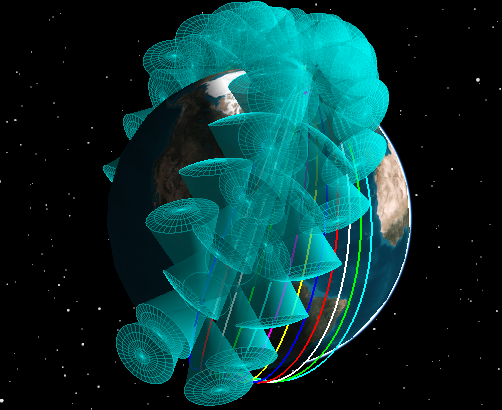
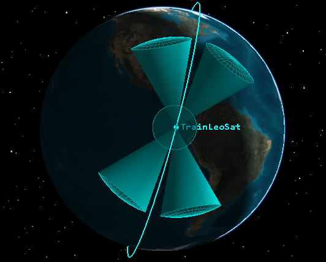

# 2023 Reference Simulations

This file presents the different simulations available in this folder.

- There are 3 reference simulations, in addition to some analysis simulations that allow you to easily assess the impact of a specific parameter.
- Each result file (.sca) and graph file (.png) has the parameters used in its name so it's easy to find.
- Each simulation is provided with a python script to generate graphs based on the result files, so you can easily change parameters and have new graphs.

> Note that each simulation has its own README file, so for more details on a specific simulation please go see each. It contains in particular instructions to run them yourself.

## Bibliography

For a better understanding of those simulations, several resources are advised for beginners and intermediate users :

1. What is Contact Graph Routing ?
    - [A youtube seminar in 2022 about CGR](https://www.youtube.com/watch?v=kGGdeTOTEyA)
    - The tutorial paper « Routing in the Space Internet » (2021) [[1]](#references)
2. Details about the constellation scenarios, the different versions of the routing protocol and the interpretation of simulation results
    - « Assessing Contact Graph Routing Performance and Reliability in Distributed Satellite Constellations » (2017) [[2]](#references)
    - « On route table computation strategies in Delay-Tolerant Satellite Networks » 2018 [[3]](#references)
3. DtnSim: Delay Tolerant Network Simulator
    - [A youtube tutorial](https://youtu.be/_5HhfNULjtk)
    - « DtnSim: Bridging the Gap between Simulation and Implementation of Space-Terrestrial DTNs » (2017) [[4]](#references)

## Vocabulary

To avoid any confusions, here is the vocabulary used :

- **GW (Gateways)** : satellites.
- **EN (End-Nodes)** : IoT devices from which data are to be retrieved (for exemple a thermometer on a mountain).
- **GS (Ground Stations)** :  ground stations where we want our data to arrive.
- **Nodes** : It's just an object in omnet++. It represents EN as well as GW and GS

## Typical scenario

A typical Direct-To-Satellite scenario can be divided in the following steps :

1. A mission control center on ground computes a contact plan and distributes it to every node of the Sat-IoT network (End-Nodes, Satellite, Ground Stations)
2. A LoRa EN has to send a packet to a LoRa Server on the Internet via a Sat-IoT LEO constellation since it does not have terrestrial connectivity
    1. If it is the first time it is sending a packet to this destination, the EN computes a contact graph on which it runs an adapted Dijkstra algorithm to compute a route to reach the destination and is stored in a routing table
    2. Depending on the routing algorithm, the Dijkstra algorithm is again run on a modified contact graph to find a new route. This step is repeated until a certain condition (all routes are found, a fixed number, ...). 
    3. A route is chosen and once the next contact in the chosen route is available (i.e. a satellite is in sight), the packet is forwarded to the next hop
3. The satellite executes the same steps than the EN in step 2. to be able to forward the packet to the next-hop
4. The packet is routed from one satellite to another until it reaches the last satellite that will fly above the Ground Station connected to the LoRa Server through a terrestrial LoRaWan network.

> ⚠️ Unlike the simulations in the papers aforementioned [2-3] and other simulations in this repository, End-nodes and Ground-Stations cannot relay trafic to satellites which is more similar to SaT-IoT scenarios in 2023. More specifically, End-Nodes can only send packets to satellite but not act as relays between satellites and Ground-Stations can only receive packets from satellite but cannot act as relays between satellites. The contact plan is built to meet those assumptions.

## Reference simulations

This folder contains 3 reference simulations. Each one of them is based on a different 12-satellites constellation but all the other parameters are the sames.
You can find all the information on the parameters in each associated README

- [Walker Star Constellation](2-Constellation_Walker_Star/) and its [README](2-Constellation_Walker_Star/README.md)
- [Walker Delta Constellation](3-Constellation_Walker_Delta/) and its [README](3-Constellation_Walker_Delta/README.md)
- [Train Constellation](4-Constellation_Train/) and its [README](4-Constellation_Train/README.md)

| Constellation | Single satellite |
|:----------------:|:-------------:|
|||
|||
|||

Respectively Star, Delta and Train Constellations

From the application view point, all End-Nodes send their traffic to a single Internet server on ground. However, when looking at the simulation file [2-Constellation_Walker_Star/Reference.ini](2-Constellation_Walker_Star/Reference.ini), it seems that each node addresses its traffic to a different Ground-Station (e.g. EN 13 is talking to GS 121). The trick is that each Ground-Station are linked with one another via the contact plan (`a contact +0 +86400 113 [113..122] 1000000`) with a high throughput of 1000kpbs. 

To give an order of magnitude, we reached 2630s (43 min) of average delay with the Walker Delta configuration, and it was the best we could achieve.

> ⚠️ In [1], the 6-min delay in figure 7 is likely to be achieved since end-nodes and ground-stations are able to store and forward packets coming from satellites which is not the case in the reference simulations in this folder.

## Routing characteristics

As seen in the [typical scenario](#typical-scenario), the results depend on the different algorithms used in the route search, the route management and the forwarding phases. 
The main challenge to properly analyze the results of those simulation is a good understanding of the different versions/extensions of those algorithms. 
The default version of those simulations is `cgrModelRev17` [2-3] which correspond to the version 2017 of CGR implemented in ION v3.6 (https://sourceforge.net/projects/ion-dtn/) before incorporating the Yen algorithm (Section 5.3 in [1]) in v3.7-v4.0 ION (known in dtnsim as `cgrModelYen`). 
`cgrModelRev17` will provide the best optimality/effort ratio for most practical use cases whereas the code of `cgrModelYen` still needs to be more polished (i.e. does not use dynamic K but a fixed one, ...) at the time of this writing (July 2023).

By default, `cgrModelRev17` simulations use the following configuration :

~~~c
dtnsim.node[*].dtn.routingType = "routeListType:allPaths-firstEnding,volumeAware:allContacts,extensionBlock:on,contactPlan:global"
~~~

The different variants are described in [1,3], appears for instance in another simulation
[jsac_rrn.ini](../jsac_rrn/jsac_rrn.ini) and are summed up in Table 3 in [3] :
- routeListType
  - oneBestPath : one-route strategy which only calculates 1 route to a destination on a Contact Graph
  - perNeighborBestPath : per-neighbor-route which calculates N (number of 1-hop neighbors in the contact plan) routes for a destination
  - allPaths-firstEnding : computes all the routes to destination. "Suppresses the first ending contact of the last path found" before each new Dijkstra iteration
  - allPaths-firstDepleted : computes all the routes to destination. "Suppresses the first contact whose volume would get fully booked if data were to flow through the path" before each new Dijkstra iteration
- volumeAware : these variants takes into account the volume metrics ETO (Earliest Tx Opportunity), PAT (Projected Arrival Time) and EVL (Effective Volume Limit) detailed in Fig. 7 and Fig. 12 on [1]
  - 1st contact : "Decreases the volume of the 1st contact in path" --> ETO, PAT and EVL are considered only on the first contact of the path.
  - All contact : "Decreases all contacts volume in the path" --> Same as above, but considering all contacts
  - off : "Volume is not considered nor annotated" --> for instance, if ETO is not considered, we assume that the transmission start at the beginning of the contact even though packets are queued in the output buffer.
- extensionBlock or source-routing (on or off) : "Source routing can be an intermediate solution where only the sender node computes the route and stores it in the bundle so that next hop nodes can forward the bundle without recomputing the route"
- contactPlan: local or global
  - When _global_, the capacity bookings are made in a unique god-mode centralized contact plan so that all nodes consume capacity synchronously (no double capacity booking). This mode is to have a theoretical upper bound.
  - When _local_, each node annotates only a local contact plan, which will differ from those in other nodes.

## Analysis simulations

There are 5 of them, in order to easily assess the impact of each parameter on the results. Indeed, each simulation is based on the reference simulations but with one different variable parameter each: that particular parameter contains several values and the other parameters are set to their value in the reference simulations.

- [5a-Simple_Constellation_Comparison](5-Comparative_Analysis/5a-Simple_Constellation_Comparison/) : to analyse the impact of the constellation. If you want to add you custom constellation, a contact plan is required.
- [5b-Packet_Size](5-Comparative_Analysis/5b-Packet_Size/) : to analyse the impact of bundle size.
- [5c-Packet_Rate](5-Comparative_Analysis/5c-Packet_Rate/) : to analyse the impact of the packet rate sent by the nodes.
- [5d-Contact_Plan_Simplification](5-Comparative_Analysis/5d-Contact_Plan_Simplification/) : to analyse the impact of removing nodes from the original contact plan. You can easily custom the number of nodes left.
- [5e-Routing_Type](5-Comparative_Analysis/5e-Routing_Type/) : to analyse the impact of the routing type chosen.

## Available metrics

Here are all the metrics that are available from dtnsim for each node.

> the mean is computed and showed behind the node 123 (node which does not exist)

- "appBundleSent:count" : the number of bundle sent by each node. It only count if the bundle is created by this node, not if relayed.
- "appBundleReceived:count" : same as sent but for reception.
- "appBundleReceivedDelay" : delay for the previous metric from the time the EN wants to sent the bundle to the time the final ground station received it at the application level
  - mean : maybe the most important metric of all : the average time that a bundle takes to arrive at its destination
  - max
  - min
- "appBundleReceivedHops:" : the number of hops that a bundle takes to arrive at destination. Each hop is counted (EN->GW, GW->GW,GW->GS,GS->GS), so by assuming that no GS is in range of the EN, the theoretical minimum is 2.
  - mean
  - max
  - min
- "sdrBytesStored:"
  - timeavg : number of Bytes stored by each node in average during the simulation
  - max : max that can be reached at one moment
- "sdrBundleStored:" : same as Bytes but for bundles
  - timeavg : number of packets stored by each node in average during the simulation
  - max ; number max of packets stored by each node during the simulation
- "dtnBundleSentToApp:count" : count of sent packets at the application layer
- "dtnBundleSentToCom:count" : number of times the bundles are relayed at the Com Layer (below application layer : routing, forwarding, MAC, ...) [[5]](#references)
- "dtnBundleReRouted:count" : count of the bundles which had at least a change of route during the simulation
- "routeCgrDijkstraCalls:sum" : number of times the function calculating a route is called
- "routeCgrDijkstraLoops:sum" : number of times a contact is explored during route calculation
- "routeCgrRouteTableEntriesCreated:" : number of times a new route is added to the routeTable
  - max
  - sum

## Results

- For each simulation,
  - the results are stored in a results/ folder, with the name of the parameters used  
  - the graphics results are stored in a figures.pdf file, to have an easy access to all the metrics.

- For the "appBundleReceivedDelay" and "appBundleReceivedHops", it's interesting to look not only at the average value, but also how values are distributed. To do so, we accessed the standard deviation value available through a histogram. So for theses metrics, the curves are different :
  - A black point shows the average value
  - The green bar represents the interval [mean-stddev;mean+stddev]
  - The grey bar represents the interval [min;max]

# References

[1] Fraire, Juan A., Olivier De Jonckère, et Scott C. Burleigh. « Routing in the Space Internet: A Contact Graph Routing Tutorial ». Journal of Network and Computer Applications 2021

[2] Fraire et al., « Assessing Contact Graph Routing Performance and Reliability in Distributed Satellite Constellations », Journal of Computer Networks and Communications 2017

[3] Fraire, Juan A., Pablo G. Madoery, Amir Charif, et Jorge M. Finochietto. « On route table computation strategies in Delay-Tolerant Satellite Networks », Ad Hoc Networks 2018

[4] Fraire, Juan A., Pablo Madoery, Fernando Raverta, Jorge M. Finochietto, et Raoul Velazco. « DtnSim: Bridging the Gap between Simulation and Implementation of Space-Terrestrial DTNs ». 6th International Conference on Space Mission Challenges for Information Technology (SMC-IT) 2017